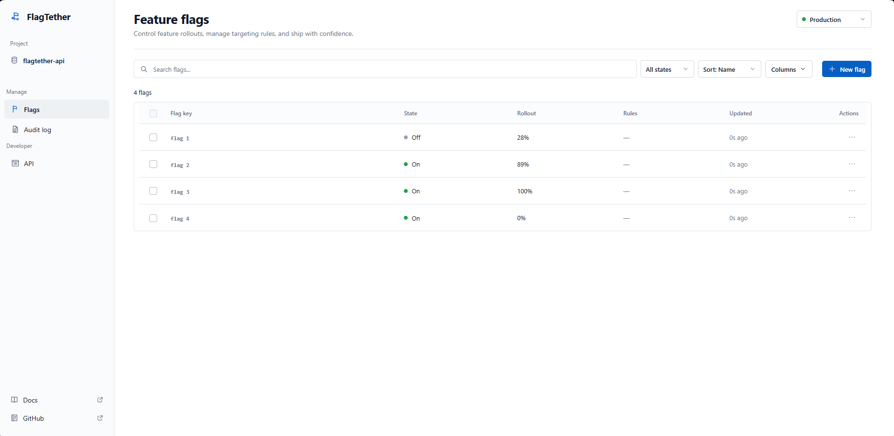
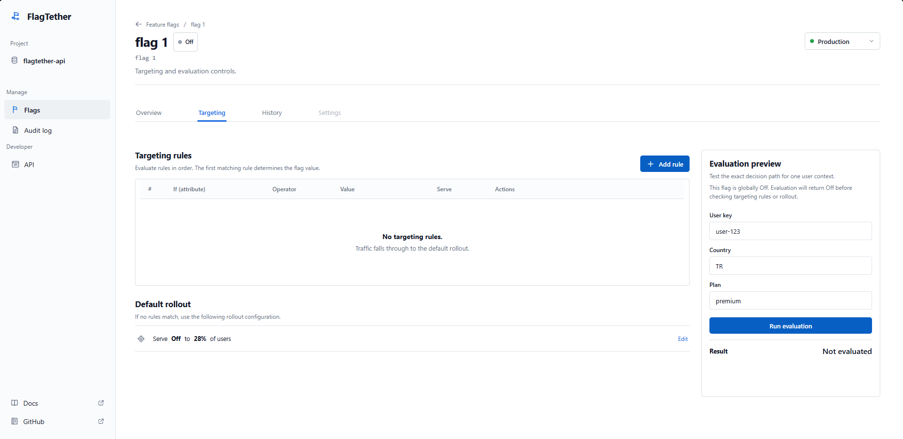
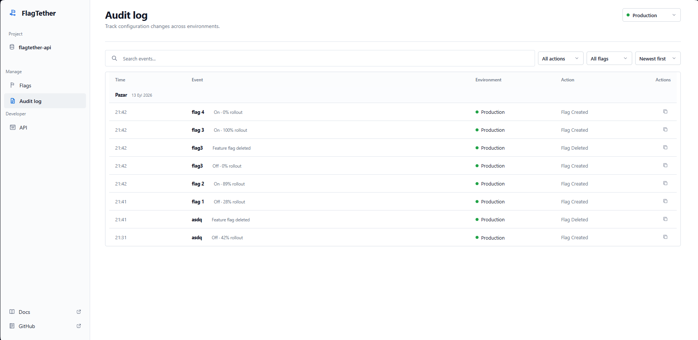

# FlagTether

A self-hosted feature-management platform for safely controlling feature exposure across development, staging, and production environments.

**Java 21 · Spring Boot · PostgreSQL · React · TypeScript · Docker · Flyway · Testcontainers**

FlagTether combines environment-scoped feature flags, deterministic percentage rollouts, targeting rules, audit history, API tooling, and a production-like Nginx + Docker Compose deployment in one full-stack portfolio project.



## Highlights

- deterministic SHA-256 based percentage rollouts;
- priority-based targeting rules evaluated before rollout;
- independent `dev`, `staging`, and `prod` configuration;
- transaction-safe configuration changes with audit logging;
- PostgreSQL persistence with Flyway-managed domain constraints;
- real PostgreSQL integration testing through Testcontainers;
- React/TypeScript administration console with API Explorer and audit views;
- production-like same-origin deployment through Nginx and Docker Compose.

## Product surfaces

FlagTether provides a focused developer-tool UI for managing feature flags:

- feature-flag list with environment switching, filtering, sorting, and creation;
- flag overview with state and rollout controls;
- targeting-rule management with priority ordering;
- user-context evaluation testing;
- audit-log filtering and change history;
- API Explorer with health visibility and Swagger access;
- responsive desktop, tablet, and mobile layouts;
- accessible loading, confirmation, toast, and error states.

### Targeting and evaluation



### Audit history



## Engineering highlights

### Backend

- feature flag creation, lookup, update, and deletion;
- independent `dev`, `staging`, and `prod` configuration;
- deterministic percentage rollouts using stable SHA-256 bucketing;
- targeting rules with priority ordering and a default priority of `100` when omitted;
- targeting by user key, country, plan, and email;
- evaluation reasons for explainable decisions;
- audit history;
- PostgreSQL persistence with database-level domain constraints;
- Flyway database migrations;
- OpenAPI / Swagger documentation;
- unit and PostgreSQL integration tests;
- Docker-based execution.

### Frontend

The `frontend/` application is built with React, TypeScript, React Router, and Vite. It uses a restrained, information-dense developer-tool interface rather than dashboard-heavy presentation patterns.

Frontend validation includes ESLint plus a TypeScript/Vite production build in CI.

## Quick start for development

### 1. Clone the repository

```bash
git clone https://github.com/Akerem-dev/flagtether.git
cd flagtether
```

### 2. Start PostgreSQL and the backend

Requirements:

- Docker
- Docker Compose

Create the local environment file:

```bash
cp .env.example .env
```

On Windows PowerShell:

```powershell
Copy-Item .env.example .env
```

Set a local PostgreSQL password in `.env`:

```text
POSTGRES_PASSWORD=change-this-password
```

Start the backend and database:

```bash
docker compose up --build
```

Backend endpoints are then available at:

```text
API:        http://localhost:8080
Swagger UI: http://localhost:8080/swagger-ui.html
OpenAPI:    http://localhost:8080/v3/api-docs
```

### 3. Start FlagTether

Requirements:

- Node.js 22+
- npm

Open a second terminal:

```bash
cd frontend
npm install
npm run dev
```

Open:

```text
http://localhost:5173
```

During local development Vite proxies `/api`, Swagger UI, and OpenAPI requests to the Spring Boot application on `http://localhost:8080`.

For deployments where the frontend and backend use different origins, set:

```text
VITE_API_BASE_URL=https://your-api.example.com
```

## Production-like full stack

A separate Compose file builds the React application into an Nginx image and keeps PostgreSQL and the Spring Boot API internal to the Docker network. Nginx serves the SPA and reverse-proxies `/api`, Swagger UI, and OpenAPI routes to FlagTether.

Create `.env` as described above, then run:

```bash
docker compose -f compose.prod.yaml up --build -d
```

Open:

```text
FlagTether:  http://localhost:3000
Swagger UI:  http://localhost:3000/swagger-ui.html
API:         http://localhost:3000/api
```

Stop the stack with:

```bash
docker compose -f compose.prod.yaml down
```

This is a production-like container topology, not a complete internet-facing production deployment. TLS termination, authentication, authorization, secret management, backups, and external observability still need to be supplied by the hosting environment.

## First API example

Create a feature flag in production:

```http
POST /api/environments/prod/flags
Content-Type: application/json

{
  "name": "new_checkout",
  "enabled": true,
  "rolloutPercentage": 20
}
```

Evaluate it for a user:

```http
GET /api/environments/prod/flags/new_checkout/evaluate?userKey=user-123
```

Example response:

```json
{
  "flagName": "new_checkout",
  "environment": "prod",
  "userKey": "user-123",
  "enabled": false,
  "reason": "ROLLOUT_MISS",
  "rolloutPercentage": 20,
  "bucket": 63,
  "matchedRuleId": null
}
```

The same environment, flag name, and user key produce the same rollout bucket.

## Evaluation model

```text
Request
  |
  v
Feature flag exists?
  |
  v
Globally enabled?
  |
  +---- no ----> disabled
  |
  v
Targeting rules by priority
  |
  +---- match --> rule result
  |
  v
Percentage rollout
  |
  v
SHA-256 deterministic bucket
  |
  v
enabled / disabled
```

Random numbers are intentionally not used for percentage rollouts. The bucket input includes:

```text
environment + flagName + userKey
```

This keeps rollout decisions stable across repeated requests.

## Targeting rules

Supported attributes:

```text
userKey
country
plan
email
```

Supported operators:

```text
EQUALS
NOT_EQUALS
CONTAINS
STARTS_WITH
ENDS_WITH
```

Rules are evaluated in ascending priority order. Priority is optional when creating a rule; when it is omitted, FlagTether assigns `100`. Lower numeric values run first, and the rule ID provides deterministic ordering when priorities are equal. If no rule matches, evaluation falls back to percentage rollout.

## Environments

A flag is configured independently for:

```text
dev
staging
prod
```

For example, one flag can be 100% enabled in development, 50% in staging, and 10% in production. The PostgreSQL uniqueness boundary is therefore the combination of flag name and environment rather than flag name alone.

## Architecture

```text
Browser
  |
  v
FlagTether / Nginx
  |
  +---- static React application
  |
  +---- /api, Swagger, OpenAPI
             |
             v
       FlagTether API
             |
             v
     Spring MVC Controller
             |
             v
      Application Service
         +---+-----------+
         |               |
         v               v
 Evaluation / Rules   Audit logging
         |
         v
      Repository
         |
         v
     PostgreSQL
```

Database schema changes are managed through Flyway. Core invariants are also enforced at the PostgreSQL boundary, including rollout and environment constraints, feature/environment uniqueness, targeting-rule referential integrity, supported targeting attributes, and nonblank persisted values. More detail, including design decisions and trade-offs, is in [docs/ARCHITECTURE.md](docs/ARCHITECTURE.md).

## Repository layout

```text
flagtether/
├── frontend/
│   ├── public/
│   ├── src/
│   ├── Dockerfile
│   ├── nginx.conf
│   ├── package.json
│   └── vite.config.ts
├── src/
│   ├── main/
│   │   ├── java/com/flagtether/
│   │   └── resources/db/migration/
│   └── test/java/com/flagtether/
├── .github/workflows/
├── Dockerfile
├── compose.yaml
├── compose.prod.yaml
├── pom.xml
└── README.md
```

## Testing and CI

Backend verification:

```bash
mvn clean verify
```

Frontend validation:

```bash
cd frontend
npm install
npm run lint
npm run build
```

GitHub Actions currently verifies:

- Java 21 / Maven backend build and tests;
- frontend ESLint and TypeScript/Vite production build;
- CodeQL security analysis.

The backend integration tests run against PostgreSQL through Testcontainers rather than substituting an in-memory database. They cover real migrations, transactional rollback behavior, evaluation, and database-level domain constraints.

Browser-level end-to-end tests and production load testing are not implemented yet.

## Running the backend without Docker

Requirements:

- Java 21
- Maven
- PostgreSQL

PowerShell example:

```powershell
$env:FLAGTETHER_DB_PASSWORD = "your-application-password"
$env:FLAGTETHER_DB_MIGRATION_PASSWORD = "your-migration-password"

mvn spring-boot:run
```

Database credentials are intentionally not stored in the repository.

## Audit history

Current audit actions include:

```text
FLAG_CREATED
FLAG_ENABLED
FLAG_DISABLED
FLAG_ROLLOUT_UPDATED
FLAG_DELETED
RULE_CREATED
RULE_DELETED
```

Recent events:

```http
GET /api/audit?limit=50
```

Audit history is intended for configuration traceability; it is not a complete security event log.

## Engineering decisions and trade-offs

- Rollout assignment uses deterministic hashing rather than random evaluation.
- Targeting rules are evaluated before percentage rollout so explicit business rules can override general rollout behavior.
- Configuration mutations and their corresponding audit writes share a transaction so partial state is not persisted when audit persistence fails.
- Integration tests use PostgreSQL through Testcontainers instead of H2.
- SQL remains explicit in repositories rather than introducing an ORM at this stage.
- Spring owns database connections through `DataSource`.
- Schema evolution belongs to Flyway migrations.
- Core domain invariants are mirrored at the database boundary so invalid direct writes cannot create state the evaluation engine cannot interpret.
- Environment is part of a feature flag's identity.
- Local frontend development uses a Vite reverse proxy rather than weakening backend CORS policy.
- The production-like stack uses same-origin Nginx proxying so the browser does not need to know the internal API hostname.

## Known limitations

FlagTether is a portfolio-scale implementation focused on feature-management fundamentals rather than a hosted multi-tenant service.

Current limitations include:

- no authentication or role-based access control;
- no hosted public demo yet;
- no browser-level E2E suite yet;
- no distributed cache;
- no SDK for application-side local evaluation;
- no real-time streaming of flag changes;
- targeting attributes are limited to a small fixed set;
- audit records do not contain authenticated actor identities;
- the included Compose stack does not provide TLS, managed secrets, backups, or production observability.

## Possible next steps

- authentication and role-based access control;
- Playwright browser-level end-to-end coverage;
- SDK-based local feature evaluation;
- caching for high-volume evaluation paths;
- real-time flag change propagation;
- production observability and managed secret handling.

## Contributing and security

Development expectations are documented in [CONTRIBUTING.md](CONTRIBUTING.md).

Do not commit credentials, tokens, `.env` files, or production secrets. Security reporting instructions are documented in [SECURITY.md](SECURITY.md).

## Status

FlagTether includes a Spring Boot backend and React administration frontend that are continuously validated in CI. A production-like Docker topology is included for full-stack demonstration. The next major quality milestones are browser-level end-to-end coverage and authentication / authorization.